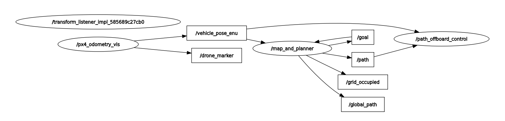

# ROS 2 UAV Planning and Control Workspace

This repository contains multiple ROS 2 packages for UAV navigation,
path planning, and PX4 offboard control.

## Packages

### **global_planner_3d**

**Responsibilities:**
- Generate random 3D occupancy grid
- Publish occupied cells as `PointCloud2`
- Subscribe to vehicle pose (ENU)
- Generate random goals
- Run A* planner in 3D
- Publish:
  - Full global path
  - Reduced PX4 path (direction-change points)

---

### **px4_odometry_vis**

**Responsibilities:**
- Subscribe to PX4 `VehicleOdometry` (NED frame)
- Convert pose to ROS ENU frame
- Publish:
  - `geometry_msgs/PoseStamped`
  - `visualization_msgs/Marker` (mesh-based drone model)

---

### **path_offboard_control**

**Responsibilities:**
- Subscribe to reduced path (`/path`)
- Subscribe to vehicle pose in ENU frame
- Enable PX4 offboard mode
- Arm the vehicle
- Follow path waypoint-by-waypoint

**PX4 Interface:**

**Publishers:**
- `/fmu/in/offboard_control_mode`
- `/fmu/in/trajectory_setpoint`
- `/fmu/in/vehicle_command`

**Subscribers:**
- `/path` (`nav_msgs/Path`)
- `/vehicle_pose_enu` (`geometry_msgs/PoseStamped`, ENU)

**Notes:**
- ENU → NED conversion is applied for PX4 setpoints
- Dummy setpoints are sent before offboard activation

## Requirements

- Ubuntu 22.04
- ROS 2 Humble
- PX4 Autopilot
- Gazebo (gz / ignition)

## Build Instructions

- Install QGroundControl-x86_64.AppImage and make it executable and run.
- Install PX4 and Micro XRCE-DDS steps as in https://docs.px4.io/main/en/ros2/user_guide
- Download packages into your ros2 workspace src folder
- Build them with "colcon build"
- run start_sim.sh file in the parent folder of "PX4-Autopilot" folder

## RQT Graph

   
  <em>Figure: Nodes and Topics</em>

## Simulation Video

🎥 **Click to watch the demo**

[▶️ Watch Video](media/rviz_video.mp4)

